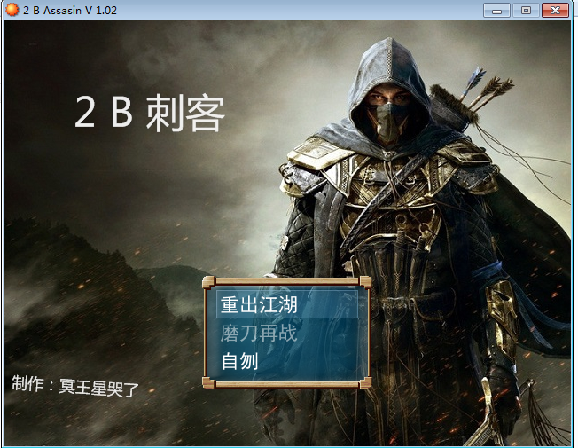
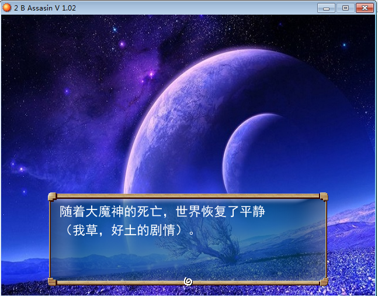
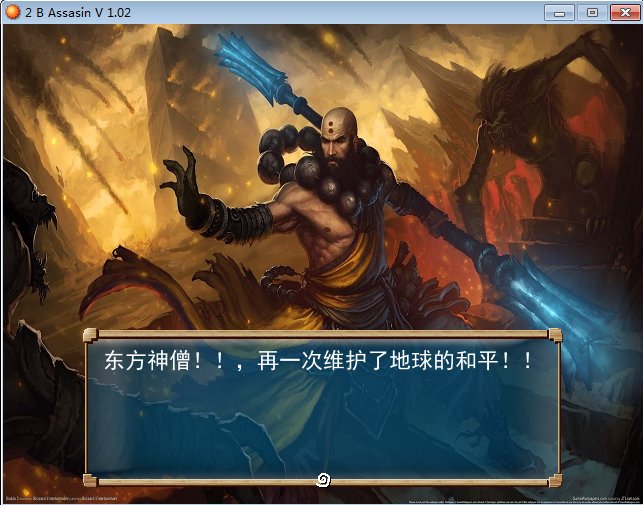
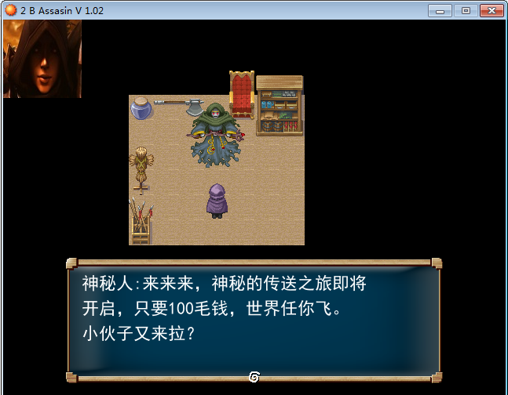
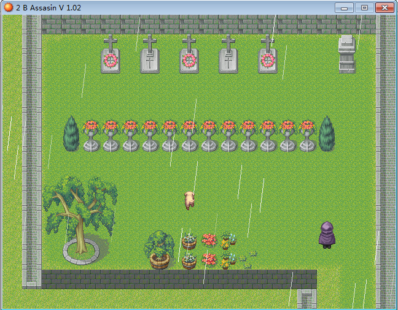
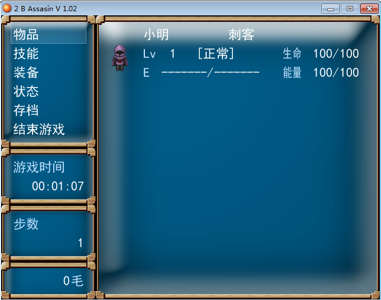
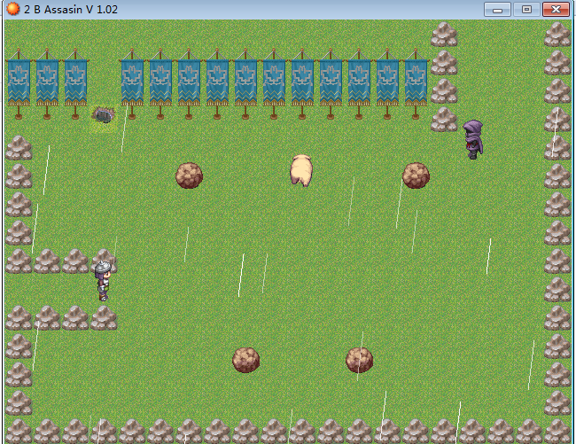

#友情提示
    
    1  游戏支持windows平台(exe)
    2  操作方式  键盘上下左右 enter esc(菜单)
    3  这个游戏是6年前的作品了，有空我把攻略和资料补齐了（当前自己都没通关）
    
#最新版本下载地址
[百度云](https://pan.baidu.com/s/116DvuSiscW8okNG681kM2Q)  

(提取码:dn5j) 

(20191017更新)

# 游戏介绍

    游戏名称 :  2B刺客，去当刺客？   2B Assasin
    游戏类型:   角色扮演/解谜（地图动作+回合战斗）
    游戏人数:   本地单人
    游戏版本:   v1.2 （污版）
    游戏功能介绍: 善恶值系统、多线剧情自由选择、劲爆音乐、酷炫人设、震撼场景、彩蛋丰富（各类游戏+动漫客串+岛国客串 50+）

#游戏展示

#规则说明

    本游戏没有等级概念，一切靠打怪赚钱换装备，配合一定的推理找出关键人物并击杀。
    在到达夜鹰公会之前属于新手任务，到达公会后将获得四个主线任务，完成四个主线任务后才
    可能出现最终BOSS，游戏中的怪在你装备成型，技能完全的时候是没有难度的，即使看不到血条，
    怪物的血条也不会超过9999.
    
    然后过关的关键并不是打不打的过，而是找不找的到，并且触发关键的事件或者道具，才能将
    敌人击杀，一旦发现迷路了或者很久没进展，或者干不过，请果断读档。
    
    最后祝游戏愉快。
#角色介绍
      (待补充)

#版本纪录

    修复了 一个BUG 曾导致发烫的铠甲这件装备不显示
    修复了 一个BUG  曾导致遇到卡卡西后死机
    修复了 一个BUG  曾导致好舒服教主不掉落奖励。
    降低了游戏的难度， 增加了野怪和士兵的金钱掉落，再也不用靠捡牛粪维持生存了！

